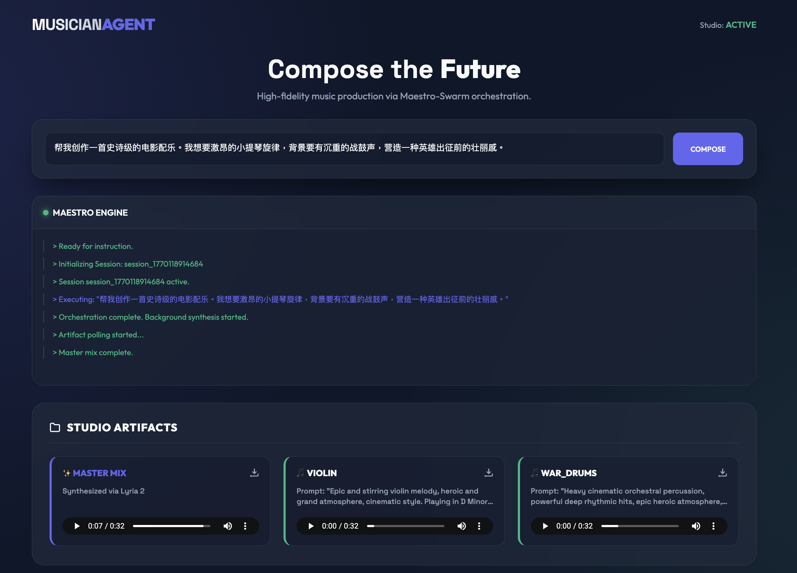
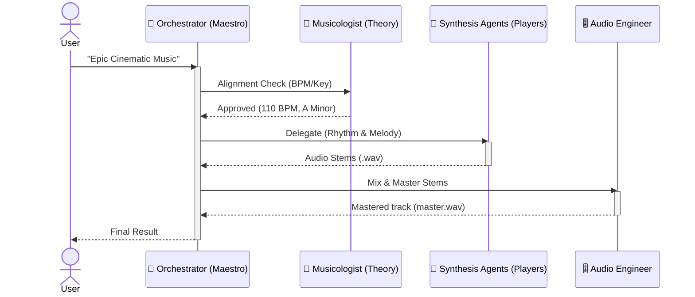

# MusicianAgent: Multi-Agent Music Orchestrator

This project implements a professional music orchestration system using the **Google Agent Development Kit (ADK)** and **Gemini 3 Flash Preview**. It leverages a hierarchical multi-agent architecture to decompose complex musical requests into specific, high-quality audio tracks.

## Overview


## 🎵 Features
- **Hierarchical Orchestration**: A central "Maestro" orchestrator coordinating specialized sub-agents.
- **Music Theory Alignment**: A Musicologist agent ensuring harmonic and rhythmic consistency.
- **Specialized Synthesis**: Dedicated agents for Percussion and Strings generation using **Google Cloud Lyria 2**.
- **Audio Engineering**: An engineer agent for final mixing and mastering.
- **ADK Native**: Built to be run with `adk web` or `adk run`.
- **Hybrid Architecture**:
    - **Reasoning**: Gemini 3 Flash Preview (Location: `global`)
    - **Synthesis**: Lyria 2 REST API (Location: `us-central1`)

## 🏗 Architecture & Workflow

The system uses a **Maestro-Swarm** pattern. Here is how the agents collaborate:



### Agent Roles & Example Inputs

| Agent | Icon | Detailed Responsibility | Example User/Agent Input |
| :--- | :---: | :--- | :--- |
| **Orchestrator** | 🎻 | **The Maestro**: Parses user requests, manages global `MusicSessionState`, and coordinates the delegation workflow between all sub-agents. | "Create a dark cyberpunk track at 140 BPM" |
| **Musicologist** | 🎹 | **Theory Expert**: Ensures genre/BPM alignment and suggests harmonic scales/keys so all synthesized tracks blend perfectly. | "Suggest a scale for a melancholic piano piece" |
| **Percussion Expert** | 🥁 | **Rhythm Specialist**: Crafts detailed, texture-rich prompts for Lyria 2 based on the requested vibe and generates the rhythm stems. | "Heavy industrial drum kit with distorted kicks" |
| **String Expert** | 🎻 | **Melodic Specialist**: Focuses on emotive layers like violins and pads, ensuring melodic alignment with the Musicologist's theory. | "Emotive cello solo with lush reverb" |
| **Audio Engineer** | 🎚 | **Post-Production**: Mixes individual stems into a `master_mix.wav` and registers all files as ADK Artifacts for manual playback. | "Mix the percussion and strings into a final master" |

<details>
<summary><b>🔍 Deep Dive: Agent Implementation Principles (Technical)</b></summary>

#### 1. Orchestrator (The Maestro)
- **Principle**: State-Driven Hierarchical Coordination.
- **Workflow**:
    - **Session Management**: Initializes and updates `MusicSessionState` (BPM, Key, Track List).
    - **A2A Delegation**: Orchestrates the communication flow via the ADK `InvocationContext`.
    - **Metadata Propagation**: Ensures sub-agent "prompts used" are socialized to the global state for UI transparency.
    - **Trigger**: Holds final execution until all stems are registered in the state.

#### 2. Musicologist (The Specialist)
- **Principle**: Harmonic & Structural Constraints.
- **Workflow**:
    - **Technical Guidance**: Maps abstract moods (e.g., "Grandeur") to technical specs (e.g., "100 BPM, D Minor").
    - **Validation**: Uses `alignment_check_tool` to verify that the Maestro's plan remains musically coherent.

#### 3. Synthesis Experts (Percussion & String)
- **Principle**: Self-Healing Synthesis Loop with Lyria 2.
- **Implementation**:
    - **Core Engine**: Direct REST API integration with **Google Lyria 2 (lyria-002)** on Vertex AI (`us-central1`).
    - **Self-Healing Algorithm**: 
        - If a prompt is blocked by safety filters (e.g., violent imagery or specific IP), the agent receives a specific error signal.
        - **Reflection**: The agent analyzes the rejected prompt using Gemini 3.
        - **Refactor**: Rewrites the prompt using musically descriptive but neutral terms (e.g., "War Drums" → "Intense Cinematic Industrial Percussion") and retries automatically.
    - **Artifact Handling**: Saves raw bytes as `ADK Part` objects and provides sidecar `.json` metadata for the Premium UI.

#### 4. Audio Engineer (The Producer)
- **Principle**: DSP-based Multi-Track Summing.
- **Implementation**:
    - **Numpy Engine**: Converts all WAV stems into `float32` numerical buffers.
    - **Time Alignment**: Pads shorter tracks with silence to ensure perfect synchronization across the timeline.
    - **Additive Mixing**: Per-sample mathematical summing of buffers to create a true multi-instrument ensemble (not simple concatenation).
    - **Clipping Protection**: Applies a safety clip layer to prevent 16-bit PCM overflow distortion during high-energy transients.
</details>

<details>
<summary><b>🛠 The Maestro's Toolbox (Capabilities Table)</b></summary>

| Agent | Tool Name | Functionality | Technical Logic |
| :--- | :--- | :--- | :--- |
| **Orchestrator** | `music_theory_alignment_tool` | Theory Validation | Delegates cross-agent verification to ensure the sequence remains harmonically valid before synthesis. |
| **Musicologist** | `alignment_check_tool` | Structural Audit | Performs a final check on BPM and Key parameters against the current track structure. |
| **Percussion** | `generate_audio_tool` | Rhythm Synthesis | Invokes Lyria 2 via REST; implements local WAV persistence and ADK artifact registration. |
| **Strings** | `generate_audio_tool` | Melodic Synthesis | Similar to Percussion but optimized for orchestral and melodic timbres. |
| **Audio Engineer** | `mix_tracks_tool` | Advanced Mixing | Performs sample-rate aligned summing of buffers using `numpy` with 16-bit integer clipping. |
| **Audio Engineer** | `play_audio_tool` | UI Integration | Registers generated masters in the ADK Artifact panel for manual user interaction. |

</details>

## 🚀 Getting Started

### Prerequisites
- Python 3.10+
- Google Cloud Project with Gemini API access
- `google-adk` installed in your virtual environment.

### Setup
1. Clone the repository to your local machine.
2. Ensure your virtual environment is activated.
3. Set up your Google Cloud credentials (e.g., `gcloud auth application-default login`).

### 🏃 Step-by-Step Usage Guide

#### Step 1: Environment Setup
Ensure you have authenticated with Google Cloud and have access to the Gemini models:
```bash
gcloud auth application-default login
```

#### Step 2: Launch Premium Studio (v0.2 Dashboard)
This is the recommended way to experience the glassmorphic UI, real-time logs, and multi-track mixing.

1.  **Start the ADK Engine (Background)**:
    ```bash
    PYTHONPATH=. ./.venv/bin/adk api_server agents/
    ```
    *Keep this terminal running.*

2.  **Start the Premium Bridge (Frontend)**:
    ```bash
    # In a new terminal
    python3 api_server.py
    ```

3.  **Access the Studio**: Open [http://localhost:8080](http://localhost:8080) in your browser.

#### Step 3: Standard ADK Web UI
If you prefer the original ADK interface:
```bash
PYTHONPATH=. ./.venv/bin/adk web agents/
```
Open [http://localhost:8000](http://localhost:8000).

#### Step 4: Interactive CLI Mode
If you prefer the terminal:
```bash
PYTHONPATH=. ./.venv/bin/adk run agents/orchestrator
```
- Type your request.
- The CLI will show "Delegating..." messages as the A2A protocol works in the background.
- Type `exit` when finished.

#### Step 5: Verify Outputs
- The agents will simulate audio generation (mocking filenames for now).
- You can find the simulated track list and "Master Mix" path in the final agent response.

### 🌟 Practical Examples

#### Example A: Epic Cinematic Music
- **Prompt**: *"Create an epic cinematic track. I want heroic violin melodies over heavy war drums, evoking a sense of grandeur."*
- **What happens**: Orchestrator consults Musicologist (sets D Minor, 100 BPM), then delegates to String and Percussion experts.

#### Example B: Cyberpunk Techno
- **Prompt**: *"Give me a 140 BPM cyberpunk techno track. Use gritty synthetic basslines and cold, industrial drum beats."*
- **What happens**: Orchestrator locks the BPM and requests high-energy synthetic prompts from the synthesis agents.

#### Example C: Travel Vlog (Acoustic & Chill)
- **Prompt**: *"Create a lighthearted, acoustic BGM for a travel vlog. Use bright acoustic guitars, subtle shakers, and a joyful whistling melody."*
- **What happens**: Orchestrator sets a cheerful mood (Major key, 105 BPM) and directs agents to focus on organic, organic timbres.

#### Example D: Mystery Investigation (Suspenseful)
- **Prompt**: *"Generate a tense, atmospheric track for a mystery scene. Focus on low-frequency drones, ticking clock sounds, and staccato violins."*
- **What happens**: Orchestrator creates a slow-burn atmosphere (70 BPM, Minor key) with emphasis on suspenseful textures.

#### Example E: Nature Documentary (Majestic)
- **Prompt**: *"Create a grand orchestral piece for a nature landscape shot. I want swelling strings and resonant kettle drums to highlight the scale of the mountains."*
- **What happens**: Synthesis agents generate cinematic "wall of sound" prompts to match the epic visual scale.

### 💡 Pro-Tips
- **Refinement**: You can follow up! Say *"The drums are too loud, please lower their volume and slow down to 80 BPM."*
- **Specific Instruments**: You can request specific world instruments like *"Add a Chinese bamboo flute (Dizi) solo in the bridge section."*

## 📂 Project Structure
```text
agents/
├── common/              # Shared Pydantic models (SessionState, Track)
├── orchestrator/       # Root agent (The Maestro)
├── musicologist/       # Music theory expert
├── percussion_expert/  # Rhythm specialist
├── string_expert/      # Melodic specialist
└── audio_engineer/     # Mixing & mastering specialist
```

## 🛠 Customization
You can modify the individual `agent.py` files in each subdirectory to refine instructions, add new tools, or swap the underlying Gemini models.
